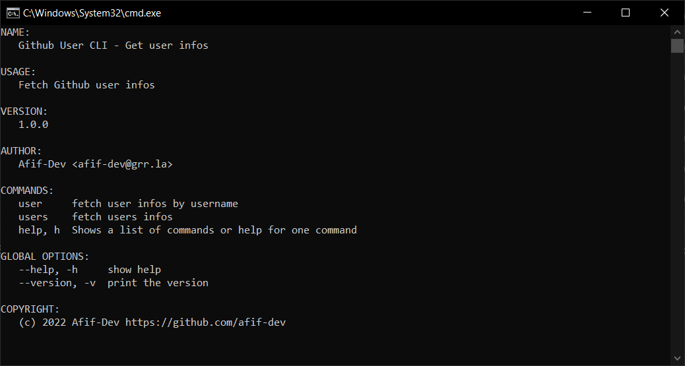

# Go Github User CLI

Github User CLI build with [Go](https://go.dev) and [urfave/cli](https://github.com/urfave/cli)

User data saved in /users folder

Users folder & file structure:

* 📂 /users
  * 📁 /avatars
  * 📄 github_username.json
  * 📁 /bulk (save data in bulk)
    * 📁 /avatars
    * 📄 github_today.json

